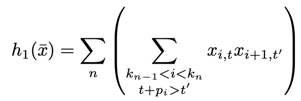
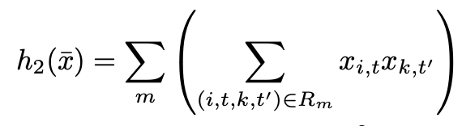
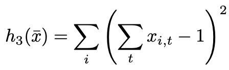
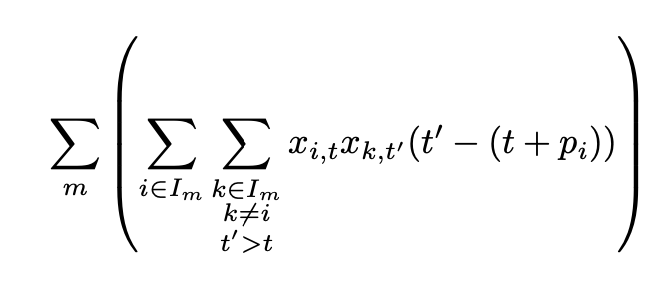
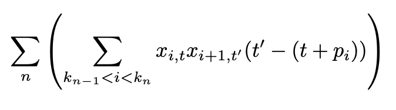
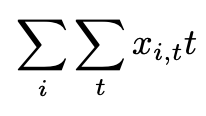

===================
Job Shop Scheduling
===================
Solver for the `Job Shop Problem <https://en.wikipedia.org/wiki/Job_shop_scheduling>`_ on a
`D-Wave <https://www.dwavesys.com/take-leap>`_ QPU. The constraints for this implementation are based on
`this paper <https://arxiv.org/abs/1506.08479>`_, by Davide Venturelli, Dominic J.J. Marchand and Galo Rojo.

Usage
-----
::

  usage: JSP.py [-h] [-a] [-r] [-v] [-m] [-s] [-q] [-i] [-p]

    optional arguments:
      -h, --help           show this help message and exit
      -a, --automatically  Automatically increase 'Eta', 'Alpha' and 'Beta', until
                           no constraint is violated anymore.
      -r, --replace        Replace old values in the yaml file, with the
                           automatically chosen ones.
      -v, --verbose        More verbose output.
      -m, --matrix         Show an interactive confusion matrix of the final Q.
      -s, --simulated      Use the simulated annealer
      -q, --quantum        Use the D-Wave quantum computer
      -i, --inspect        Use the D-Wave inspector
      -p, --plot           Plot the graph

In :code:`parameters.yaml` you can tweak the lagrange parameters.

===========
Hamiltonian
===========

Constraints
-----------
We have 3 constraints as discribed in the paper.

The first one ensures the order of operations in a job

The second one ensures that no two operations are running on one machine at the same time

The third one sets the constraint, that every operations runs only ones

Objective Function
------------------
To have the output as dense and optimal as possible, we punish unused time between operations.

Machine level:

Job level:

Now we need to insure that the solution starts as early as possible:

The sum of all these objective functions and constraints, in addition to the lagrange parameters make up the final hamiltonian.